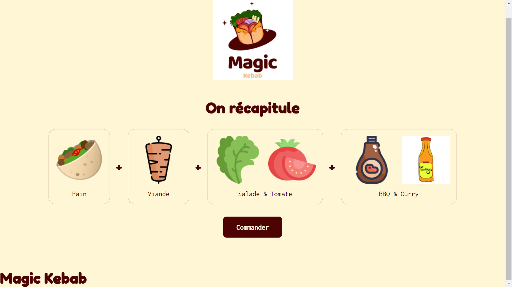

<h1 align="center">Magic Kebab</h1>

<p align="center">
  
</p>

<p align="center">
  Le configurateur de kébab 2.0 ! Built with React
</p>

<p align="center">
  <a href="https://stantanasi.github.io/magic-kebab">stantanasi.github.io/magic-kebab</a>
</p>



## Getting started

This project was bootstrapped with [Create React App](https://github.com/facebook/create-react-app).

### Prerequisites

- Install [Node.js](https://nodejs.org) which includes [Node Package Manager](https://www.npmjs.com/get-npm)


### Clone the project to your local machine

```bash
git clone https://github.com/stantanasi/magic-kebab.git
cd magic-kebab
```

### Install the packages required

```bash
npm install
```

### Run the application

```bash
npm start
```

## Author

- Lory-Stan TANASI

## License

This project is licensed under the Apache-2.0 License - see the [LICENSE](LICENSE) file for details

<p align="center">
  <br />
  © 2021 Lory-Stan TANASI. All rights reserved
</p>
